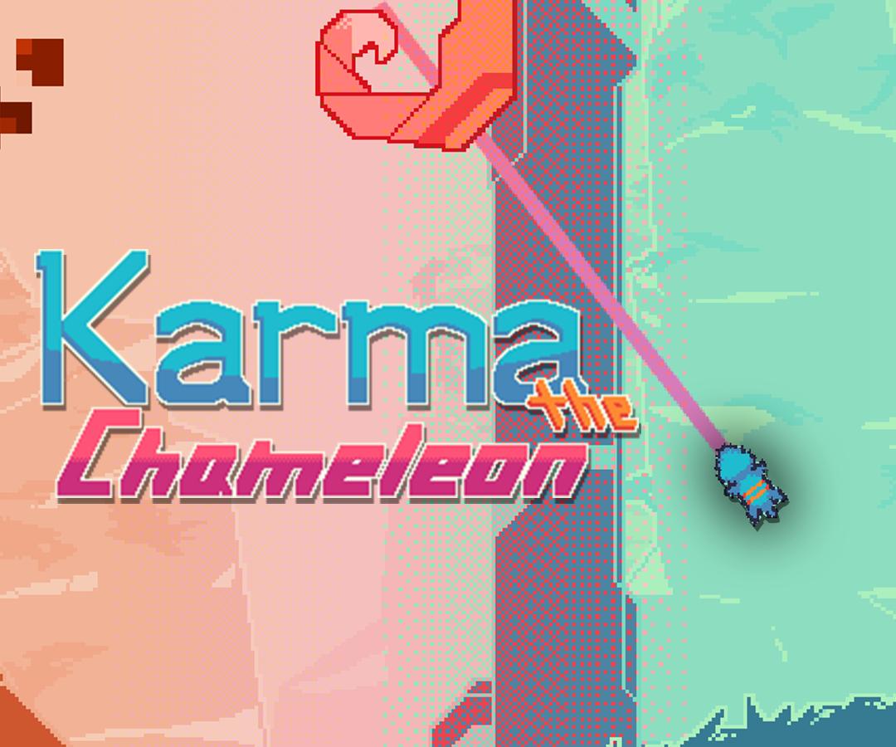

# Karma The Chameleon

By: James Jek, Martin Perina, and Nick Pastoria

Created for CMPM and ARTG 120 "Endless Runner Project" during Spring of 2022.

We were tasked with creating and endless runner in phaser under a two week time limit.

During this project we learned a lot about how to use phaser, and how to code with it in such a way that makes your game expandable. We also learned about the production pipleine seeing as we spend almost the entire first half of the development time prototyping just the grapple. Obviously this was worth it in the end because the grapple feels great, but as a result of spending so much time on the grapple we lost a lot of time for polish and introducing other mechanics.

 We wanted to focus our design around using a grapple hook, so we came up with the idea of using a chameleon who discovers that he can use his tongue to grapple on to branches. We didn't have time to implement the actual scene itself when the chameleon learns he can use his tongue.

---
## Play the Web Version
[Karma the Chameleon Web Link](https://github.com/garudaramuda.github.io/KarmaTheChameleon/)

## How to compile code
The code can be cloned and played locally. 

We reccomend you to use the **live server** plugin on vscode

## Files Included
Many of the files in this project are extremeley bloated and one use. Use at your own caution.
| Name | Description |
| ----------- | ----------- |
| index.html | The main webpage for the game |
| Main.js | The main javascript file that sets up the phaser library to run|
| Load.js | The JavaScript file that loads all the assets that the game uses so it doesn't stutter on scene change |
| Menu.js | Menu scene that allows player to click to main game scene |
| Play.js | The main game scene where everything happens |
| Death.js | The scene the player is transferred to when they die | 
| Fire.js | Handles the fire and all its assets as it chases the player|
| GrappleBranch.js | Handles the grapple branches that the player can grab onto |
|Player.js | One of the first classes we wrote, and is therefore extremeley bloated. Handles all of the player interactions and logic |
|Tongue.js | Handles the tongue asset and animation which really just hides invisible constraint points |